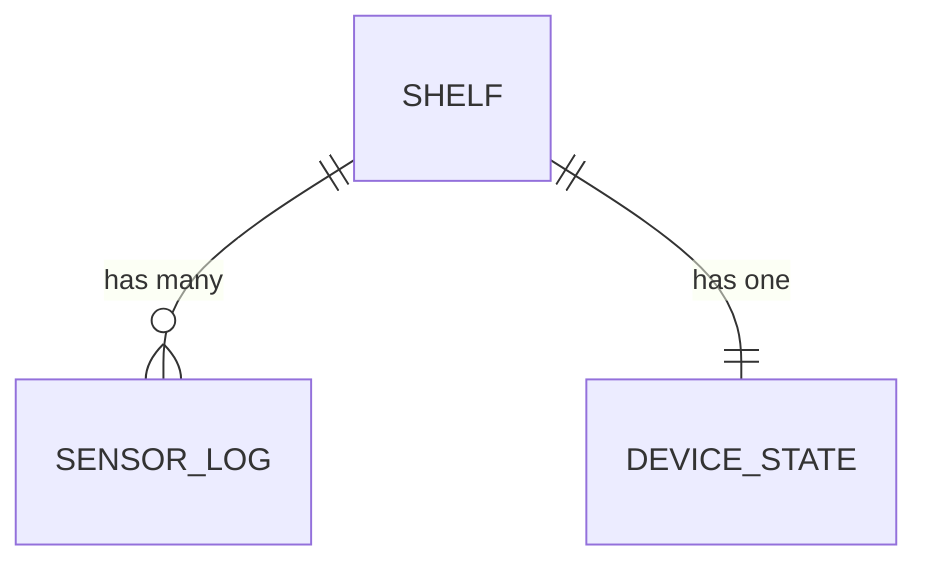

# Техническая спецификация: Tamyr Backend (Smart Hydroponics API)

Этот документ — **единая спецификация** бэкенда проекта Tamyr (Smart Hydroponics Digital Twin): что именно реализовано в репозитории, какие контракты поддерживаются, какие инварианты соблюдаются, и как всё это запускать/разворачивать.

---

## 1. Контекст и границы системы

### 1.1. Назначение

**Tamyr Backend** — HTTP JSON API для «цифрового двойника» гидропонной установки.

- **Собирает телеметрию** (температура, влажность, CO₂, TVOC) по полкам (`shelves`).
- **Хранит состояние исполнительных устройств** (свет/вентилятор/уставки, режим AI).
- **Выдаёт агрегированные срезы** для дашборда и детальных экранов.
- **Предоставляет AI-чат** (контекстный агроном) с привязкой к полке и её текущим данным.

### 1.2. В зоне ответственности

- **Контракты API**: эндпоинты, схемы запросов/ответов, коды ошибок.
- **Модель данных** в PostgreSQL и работа через ORM.
- **Расчёт производных величин** (например, VPD на сервере).
- **Валидация входных данных** (Pydantic) и доменные ограничения (например, запрет ручного управления в AI-режиме).

### 1.3. Вне зоны ответственности (на текущем этапе)

- **Аутентификация/авторизация** (в коде нет).
- **Push/real-time доставка** (WebSocket/MQTT не реализованы).
- **Полноценные миграции** (Alembic не подключён; используется `create_all` при старте).
- **Стабильное versioning API** (`/api/v1` не используется).

---

## 2. Технологический стек

- **FastAPI**: HTTP слой, DI, OpenAPI.
- **Uvicorn**: ASGI сервер.
- **SQLAlchemy 2.x (async)** + **asyncpg**: доступ к PostgreSQL.
- **Pydantic v2** + **pydantic-settings**: схемы и настройки из окружения.
- **PostgreSQL 16**: основная БД.
- **Groq SDK**: провайдер LLM для AI ассистента.
- **Docker Compose**: локальная инфраструктура (Postgres, при необходимости весь стек).

---

## 3. Структура проекта (факт)

```text
backend/
  app/
    api/
      deps.py
      router.py
      routes/
        assistant.py
        dashboard.py
        shelves.py
        sensors.py
    core/
      config.py
      utils.py
    db/
      session.py
    models/
    schemas/
    main.py
  requirements.txt
  seed.py
  Dockerfile
```

Ключевые точки входа:

- **`app/main.py`**: создание приложения, подключение роутера, lifespan-инициализация схемы.
- **`app/api/router.py`**: подключение роутеров `dashboard`, `shelves`, `sensors`, `assistant`.
- **`app/db/session.py`**: `AsyncSession` на запрос (dependency).

---

## 4. Конфигурация и окружение

### 4.1. Переменные окружения

Фактически используется `.env` в `backend/` (через `pydantic-settings`).

- **`DATABASE_URL`**: строка подключения к Postgres (формат `postgresql+asyncpg://...`).
- **`GROQ_API_KEY`**: ключ доступа для AI ассистента.
  - Если пустой/не задан — `POST /assistant/chat` возвращает **503**.
  - Если ключ неверный — возможен **401**.
- **`GROQ_MODEL_NAME`** (если предусмотрено конфигом): имя модели Groq для chat completion.

### 4.2. База данных

- СУБД: PostgreSQL.
- Инициализация схемы: при старте приложения выполняется `Base.metadata.create_all(...)`.
  - Это удобно для dev, но **не заменяет миграции**.

---

## 5. Модель данных

### 5.1. Сущности

- **Shelf**: полка/контур управления.
  - `id`, `name` (уникальный), `status` (`OK`/`WARNING`/`CRITICAL`).
- **SensorLog**: измерения во времени.
  - `shelf_id`, `temperature`, `humidity`, `co2`, `tvoc`, `timestamp`.
- **DeviceState**: состояние исполнительных устройств/уставок для полки.
  - 1:1 с `Shelf` (PK = `shelf_id`).
  - `light_brightness`, `fan_speed`, `target_temperature`, `heater_on`, `humidifier_on`, `is_ai_mode`.

### 5.2. Связи



- **Shelf 1:N SensorLog**: при удалении полки — каскадно удаляются логи.
- **Shelf 1:1 DeviceState**: при удалении полки — каскадно удаляется состояние устройств.

### 5.3. Доменный инвариант: AI режим (`is_ai_mode`)

`DeviceState.is_ai_mode` задаёт режим управления:

- Если `is_ai_mode == true`, то в эндпоинте управления **запрещено** менять любые поля, кроме самого `is_ai_mode`.
- Попытка ручного изменения при активном AI режиме должна приводить к **409 Conflict**.

Цель: исключить «случайное ручное вмешательство», пока система в автоматическом режиме.

---

## 6. Бизнес-вычисления

### 6.1. VPD

Для детального среза полки считается **VPD (kPa)** на основе температуры и влажности.

- Используется утилита `calculate_vpd(temperature, humidity)` из `app/core/utils.py`.
- Если данных нет (нет последнего `SensorLog`) — VPD отсутствует/`null` в ответе.

---

## 7. HTTP API

### 7.1. Общие принципы

- Формат: **JSON**.
- Версионирования вида `/api/v1` сейчас нет (пути — корневые).
- Ошибки: `HTTPException` с полем `detail` (строка).

### 7.2. Эндпоинты

#### Health

- **`GET /`**: проверка живости сервиса.

#### Dashboard

- **`GET /dashboard/summary`**: краткая сводка по полкам для дашборда (id, name, status).

#### Shelves

- **`GET /shelves/{shelf_id}/current`**: «текущий срез» по полке:
  - данные полки,
  - последний лог датчика (если есть),
  - состояние устройств (если есть),
  - рассчитанный `vpd` (если есть данные для расчёта).

- **`GET /shelves/{shelf_id}/logs?limit=...`**: список логов датчика.
  - `limit` ограничен диапазоном (по коду — 1..2000, дефолт 200).
  - порядок: от старых к новым.

- **`PATCH /shelves/{shelf_id}/control`**: частичное обновление `DeviceState`.
  - если `is_ai_mode == true`: разрешено менять только `is_ai_mode`, иначе **409**.

#### Sensors

- **`POST /sensors/report`**: приём телеметрии (создаёт `SensorLog`).
  - если полки не существует: **404**.

#### Assistant (AI Agronomist)

- **`POST /assistant/chat`**: получение ответа AI ассистента с контекстом конкретной полки.

Request:

```json
{ "shelf_id": 1, "message": "Что делать при высоком VPD?" }
```

Response:

```json
{ "reply": "..." }
```

Ключевые особенности:

- Если `GROQ_API_KEY` не настроен: **503** (`detail`: `"GROQ_API_KEY is not configured."`).
- Если `shelf_id` не существует: **404**.
- Ошибки провайдера:
  - **401**: неверный/неавторизованный ключ Groq (сообщение подсказывает, где взять ключ).
  - **429**: rate limit.
  - **502**: upstream/client error или пустой ответ от модели.

---

## 8. Локальный запуск

### 8.1. Только PostgreSQL в Docker, API локально

- Поднять БД: `docker compose up -d postgres` (из корня монорепозитория).
- Запустить API локально: активировать venv и выполнить `uvicorn app.main:app --reload --host 0.0.0.0 --port 8000` из каталога `backend/`.

### 8.2. Всё в Docker

- `docker compose up -d --build` (из корня монорепозитория).

### 8.3. Сиды (dev)

- `python seed.py` (из `backend/`) создаёт таблицы/полки/начальные состояния и синтетические логи за несколько дней (для дашборда/графиков).

---

## 9. Нефункциональные требования (целевые)

- **Надёжность**: корректная обработка ошибок БД/провайдера AI, отсутствие утечек соединений.
- **Производительность**: чтение логов ограничено `limit`; при росте данных нужны индексы и/или партиционирование.
- **Безопасность**: на текущем этапе отсутствует auth; для production необходимо закрыть endpoints управления и ingest.
- **Наблюдаемость**: рекомендуется добавить структурированные логи и метрики.

---

## 10. Roadmap (рекомендованные улучшения)

- **Миграции Alembic** вместо `create_all` при старте.
- **Auth**:
  - API key для устройств на `POST /sensors/report`,
  - user auth для мобильного клиента и `PATCH /control`.
- **Real-time** (MQTT/WebSocket) для live-дашборда без опроса.
- **Масштабирование логов**:
  - индексы `(shelf_id, timestamp)`,
  - партиционирование по времени,
  - политика хранения (TTL/агрегации).
- **CI/CD**: сборка образов, проверки, деплой.
